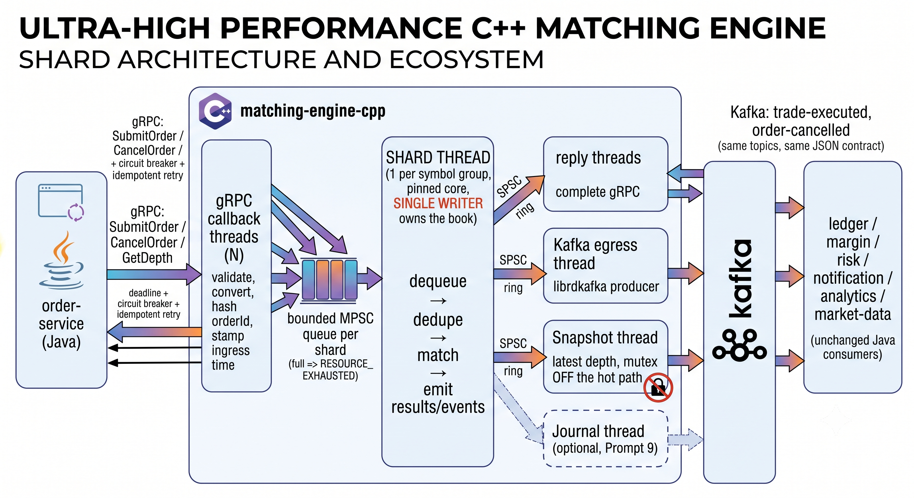

# C++ Matching Engine Migration: Main Design Choices

We are rewriting the matching engine from Java to C++ to improve performance and predictability. The following list outlines the primary design choices and architectural shifts for the new C++ matching engine service.

## Threading
* **Shard-based Concurrency**: One writer thread per symbol shard.
* **Communication**: Lock-free queues are used between threads.
* **Overload Handling**: Bounded queues that reject requests under overload conditions.

## Order Book
* **Data Types**: Integer prices in paise and whole-share quantities, eliminating the need for `EPSILON` floating-point checks.
* **Price Levels**: Sit in a flat array with a bitmap to track the best bid and ask efficiently.
* **Order Storage**: Orders live in an intrusive linked list per level and come from a pre-allocated pool. This guarantees there is no memory allocation on the hot path.

## Order-Service Link
* **Protocol**: gRPC replaces REST for lower latency and better throughput.
* **Idempotency**: Because the engine is idempotent on `orderId`, order-service retries are inherently safe.

## Trade IDs
* **Deterministic Generation**: Trade IDs use a deterministic format (`TRD-<shard>-<seq>`).
* **Replayability**: A replay will regenerate the exact same IDs, allowing downstream idempotent consumers to easily deduplicate events.

## Fallback
* **Safety Mechanism**: The original Java engine stays behind a feature flag. This serves as the reference for parity tests and allows for a seamless rollback if necessary.
