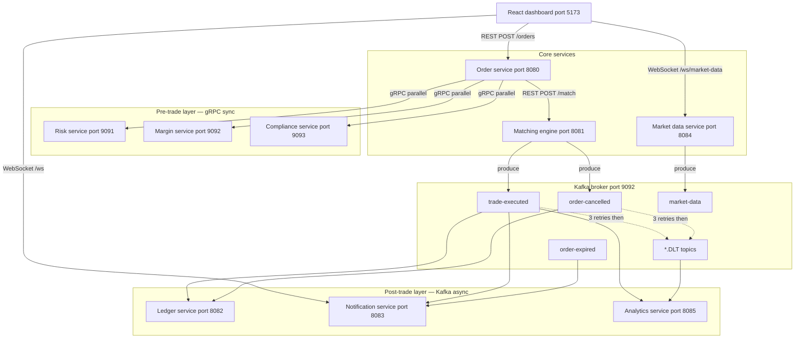
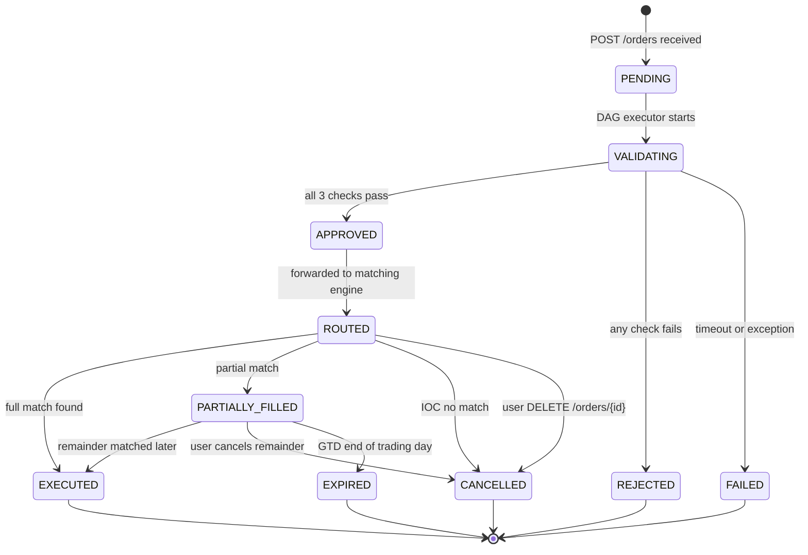

# TradeFlow Engine

TradeFlow is an open-source distributed trade orchestration and matching-engine system designed to explore the architecture, concurrency, reliability, and event-driven processing patterns used in electronic trading systems.

> **Note:** TradeFlow is a simulation/research/engineering project. It is not designed to be production-ready out-of-the-box. It is a control system that ensures safe, parallel execution of dependent financial validations before routing orders to a simulated exchange.

---

## Why TradeFlow exists
TradeFlow was built to demonstrate correctness under concurrency — the core problem every real trading system solves. It implements real-world fintech patterns such as parallel DAG-based pre-trade validation, circuit breakers, dead letter queues, idempotency, and high-throughput order matching, making it an excellent learning and research resource for distributed systems engineers.

---

## Key capabilities

| Concept | Implementation |
|---|---|
| DAG-based orchestration | `DAGExecutor` fires 3 gRPC calls in parallel via `CompletableFuture.allOf()` |
| Parallel execution under constraints | Independent tasks run concurrently, fan-in at a deterministic aggregation point |
| Failure handling and retry | Per-task retry with exponential backoff, 500ms timeout per call |
| Circuit breakers | Resilience4j on all 3 gRPC channels — CLOSED / OPEN / HALF_OPEN |
| Idempotency | `processedTradeIds` Set prevents double-processing of Kafka events |
| Order state machine | 10 states from PENDING to EXECUTED/CANCELLED/EXPIRED with valid transitions only |
| Real fintech domain logic | Position limits, margin reservation, price circuit breakers, IST market hours |
| Async event-driven architecture | Kafka fan-out to 3 independent consumers post-trade |
| Dead letter queues | 3-retry backoff then DLT routing with full header preservation |
| Price discovery | LTP and VWAP update in real time from actual trade executions |
| Per-symbol order book | Isolated `SymbolOrderBook` per symbol via `OrderBookRegistry` |
| Partial fills | Loop-based matching consumes multiple price levels, re-queues remainder |

---

## Architecture

TradeFlow is structured into synchronous pre-trade validation and asynchronous post-trade processing.

- **Pre-Trade Layer**: Synchronous, low-latency gRPC calls validating risk, margin, and compliance rules in parallel.
- **Core Matching Engine**: Per-symbol order books enforcing price-time priority.
- **Post-Trade Layer**: Kafka-driven asynchronous services (Ledger, Analytics, Notifications) consuming trade executions.

---

## Architecture diagram

```
┌─────────────────────────────────────────────────────────────┐
│                    React dashboard :5173                      │
│         REST │ WebSocket (notifications, market data)        │
└──────────────────────┬──────────────────────────────────────┘
                       │ REST
                       ▼
              ┌─────────────────┐
              │  Order service  │  :8080  — OMS + DAG executor
              └────────┬────────┘
                       │ gRPC (parallel, sync)
         ┌─────────────┼─────────────┐
         ▼             ▼             ▼
   ┌──────────┐  ┌──────────┐  ┌──────────────┐
   │  Risk    │  │  Margin  │  │  Compliance  │
   │ :9091    │  │ :9092    │  │  :9093       │
   └──────────┘  └──────────┘  └──────────────┘
         │ all pass → fan-in
         ▼
   ┌─────────────────────┐
   │   Matching engine   │  :8081  — per-symbol order books
   └──────────┬──────────┘
              │ Kafka produce
              ▼
   ┌──────────────────────────────┐
   │  Kafka broker  :9092         │
   │  trade-executed              │
   │  order-cancelled             │
   │  order-expired               │
   │  market-data                 │
   │  *.DLT (dead letter topics)  │
   └───────┬──────────────────────┘
           │ fan-out (independent consumer groups)
    ┌──────┼──────────┐
    ▼      ▼          ▼
┌────────┐ ┌────────┐ ┌──────────┐
│Ledger  │ │Notif   │ │Analytics │
│:8082   │ │:8083   │ │:8085     │
└────────┘ └────────┘ └──────────┘
```



---

## Order lifecycle



---

## Services

| Service | Port | Protocol | Responsibility |
|---|---|---|---|
| order-service | 8080 | REST + gRPC client | OMS, DAG executor, state machine |
| risk-service | 9091 (gRPC) 8090 (HTTP) | gRPC server | Position limits, daily loss, order value |
| margin-service | 9092 (gRPC) 8092 (HTTP) | gRPC server | Margin calculation and reservation |
| compliance-service | 9093 (gRPC) 8093 (HTTP) | gRPC server | Market hours, price bands, duplicates |
| matching-engine | 8081 | REST | Per-symbol order books, partial fills |
| ledger-service | 8082 | Kafka consumer | Balance, holdings, settlement |
| notification-service | 8083 | Kafka consumer + WebSocket | User trade notifications |
| analytics-service | 8085 | Kafka consumer | Per-symbol stats, DLQ monitor |
| market-data-service | 8084 | Kafka producer + WebSocket | LTP, VWAP, price simulation |

---

## Technology stack

| Layer | Technology |
|---|---|
| Language | Java 17 |
| Framework | Spring Boot 3.x |
| Pre-trade RPC | gRPC (io.grpc) + Protobuf |
| Messaging | Apache Kafka |
| Resilience | Resilience4j (circuit breaker, retry) |
| Real-time push | Spring WebSocket |
| Metrics | Micrometer + Prometheus |
| Dashboards | Grafana |
| Build | Maven multi-module |
| Containers | Docker + Docker Compose |
| Frontend | React 18 + TypeScript + Vite + Tailwind CSS |
| Charts | Recharts |
| Testing | JUnit 5 + Testcontainers + Mockito + Awaitility |

---

## Quick start

### Prerequisites

- Java 17+
- Maven 3.9+
- Docker Desktop (running)
- Node 18+

### Step 1 — Copy environment file

```bash
cp .env.example .env
```

### Step 2 — Start infrastructure

```bash
docker-compose up -d zookeeper kafka mysql
```

Wait 20 seconds for Kafka to be ready, then verify:

```bash
docker-compose ps
# Both zookeeper and kafka should show "Up"
```

### Step 3 — Build all modules

```bash
mvn clean install -DskipTests
```

First build takes ~2 minutes (protobuf generation included).

### Step 4 — Start gRPC services first

```bash
cd risk-service       && mvn spring-boot:run &
cd margin-service     && mvn spring-boot:run &
cd compliance-service && mvn spring-boot:run &
```

Wait until all three log `gRPC server started on port 909x`.

### Step 5 — Start matching engine

```bash
cd matching-engine && mvn spring-boot:run &
```

### Step 6 — Start order service

```bash
cd order-service && mvn spring-boot:run &
```

### Step 7 — Start post-trade consumers

```bash
cd ledger-service       && mvn spring-boot:run &
cd notification-service && mvn spring-boot:run &
cd analytics-service    && mvn spring-boot:run &
```

### Step 8 — Start market data service

```bash
cd market-data-service && mvn spring-boot:run &
```

### Step 9 — Start React dashboard

```bash
cd dashboard
npm install
npm run dev
```

### Step 10 — Start monitoring stack

```bash
docker-compose up -d prometheus grafana
```

---

## API reference

### Order service — :8080

| Method | Path | Body | Response | Description |
|---|---|---|---|---|
| POST | /api/v1/orders | `PlaceOrderRequest` | 202 `{orderId, status}` | Place a new order |
| GET | /api/v1/orders/{orderId} | — | `Order` | Get order by ID |
| GET | /api/v1/orders/user/{userId} | — | `List<Order>` | All orders for a user |
| DELETE | /api/v1/orders/{orderId} | — | 200 / 409 | Cancel an order |
| GET | /api/v1/health/circuit-breakers | — | CB states | Risk/Margin/Compliance CB state |

**PlaceOrderRequest**
```json
{
  "userId":    "U1",
  "symbol":    "INFY",
  "side":      "BUY",
  "quantity":  10,
  "price":     1850.00,
  "orderType": "LIMIT"
}
```

*For more endpoints, explore the controllers for each service or use the Postman collection provided in the repository.*

---

## Testing

### Unit tests (no infrastructure needed)

```bash
mvn test -pl order-service,matching-engine,risk-service,margin-service,compliance-service
```

### Integration tests (Testcontainers — spins up its own Kafka)

```bash
mvn test -pl integration-tests
```

Scenarios covered:
1. Happy path — order fully matched end to end
2. Order rejected when any validation fails
3. IOC partial match — remainder cancelled
4. Circuit breaker trips after repeated failures
5. DLQ receives event after 3 consumer failures

---

## Observability

### Metrics (Prometheus + Grafana)

Custom metrics exposed at `/actuator/prometheus` on every service. Grafana dashboard auto-provisions on startup at `http://localhost:3000` (admin / admin).
Panels include: order pipeline stats, DAG p50/p95/p99 latency, circuit breaker states, Kafka consumer lag, DLQ count, JVM heap, CPU per service, order book depth.

### Distributed tracing via correlation ID

Every HTTP request gets a correlation ID (from `X-Correlation-ID` header or generated). Placed in MDC — every log line across every service includes it.

### Circuit breakers

Resilience4j circuit breakers on all 3 gRPC channels. Live circuit breaker states: `GET /api/v1/health/circuit-breakers`

---

## Design decisions

**Why gRPC for pre-trade, Kafka for post-trade?**
Pre-trade validation is synchronous — the OMS must wait for all three results before routing. gRPC over HTTP/2 provides the lowest latency for this blocking call. Post-trade processing (ledger, notifications, analytics) does not block trade confirmation. Kafka decouples producers and consumers, enables replay on failure, and isolates consumer group failures from each other.

**Why `ConcurrentSkipListMap` for the order book?**
Sorted by price (O(log n) for best bid/ask) and lock-free for concurrent reads. `TreeMap` is sorted but requires external synchronization — a global lock under concurrent order flow. `HashMap` is fast but unsorted — finding the best price requires a full O(n) scan.

**Why `CompletableFuture.allOf()` and not sequential calls?**
Three sequential gRPC calls at 150ms each = 450ms total. Three parallel calls = 150ms total (the slowest one). The pre-trade budget is 500ms. Sequential execution would frequently breach it.

**Why 202 Accepted and not 200 OK for order placement?**
202 is the correct HTTP semantic — the request is received and accepted for processing, but processing has not completed. The client must poll for the final status. This is exactly how real brokers behave.

---

## Known simplifications

These are intentional trade-offs for a development/research system. Each has a production alternative:

- **In-memory order book (`ConcurrentSkipListMap`)**: Production alternative is Redis sorted sets or custom C++ low-latency memory structures persistent across restarts.
- **In-memory positions and balances (`ConcurrentHashMap`)**: Production alternative is PostgreSQL for audit trail, Redis for real-time checks.
- **Floating-point Prices (`double`)**: Intentionally simplified for this project, but a production system requires `BigDecimal` or fixed-point integer ticks to avoid decimal rounding errors.
- **Idempotency via In-Memory Set**: Kafka consumers skip duplicates using an in-memory set which resets on restart. A production system requires durable deduplication (e.g., Redis).
- **Simulated Market Data**: Fixed starting prices and simulated random-walk ticks instead of an external exchange feed.
- **Development-only Authentication**: Pre-seeded test users without JWTs or OAuth2.

---

## Roadmap

**v0.1 — Open-source foundation** (Current)
- License, Contributor documentation, CI, templates, architecture docs.

**v0.2 — Reliability**
- Stronger integration tests, Kafka recovery, durable idempotency, failure testing.

**v0.3 — Performance**
- Matching engine benchmarks, lock contention analysis, latency measurements.

**v0.4 — Market data**
- Replay, sequencing, reconnection, dynamic subscriptions.

---

## Contributing

We welcome contributions! Please see our [CONTRIBUTING.md](CONTRIBUTING.md) for local setup instructions, architecture details, and pull request requirements. Be sure to follow our [Code of Conduct](CODE_OF_CONDUCT.md).

---

## License

This project is licensed under the [Apache License 2.0](LICENSE).
